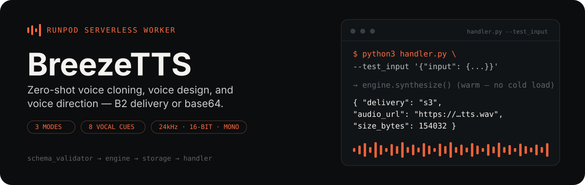
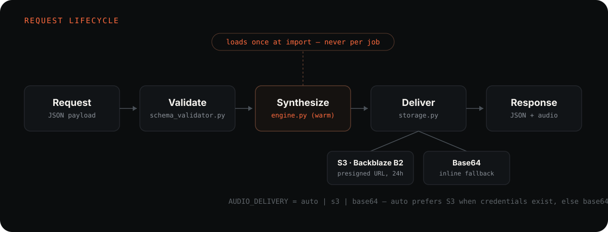

<p align="center">
  
</p>

<p align="center">
  
  
  
  
</p>

A [RunPod serverless](https://docs.runpod.io/serverless/overview) worker that wraps
[Breeze TTS 2](https://github.com/breezeblue-ai/breeze-tts) — a bilingual (EN/ZH), open-weight
text-to-speech model — behind a single JSON handler. Send text and it comes back as a
24 kHz mono 16-bit WAV, delivered either as a Backblaze B2 presigned URL or inline base64.
The model loads once, at process start; every request after that hits an already-warm engine.

## How a request moves through the worker

<p align="center">
  
</p>

1. **`schema_validator.py`** decodes every `reference_audio` clip exactly once, enforces the
   4 MB per-clip / 6 MB total decoded-bytes limits, resolves the synthesis mode, and returns a
   `NormalizedRequest` or a structured `ValidationError` — no request reaches the model unvalidated.
2. **`engine.py`** bootstraps the model at *import time* — never inside a request — and exposes
   one function, `synthesize(request) -> bytes`. A cold start never happens mid-job.
3. **`storage.py`** uploads the WAV to Backblaze B2 and returns a 24-hour presigned URL, or
   inlines it as base64 when no credentials are configured.
4. **`handler.py`** wires the three together under `runpod.serverless.start(...)`, catches every
   failure mode (validation, synthesis, delivery) as a structured error, and dumps a full
   traceback to stdout on crash — never a credential, never raw reference audio.

## Three ways to give it a voice

| Mode | Reference audio | Instruction | What it does |
|---|:---:|:---:|---|
| **Voice Clone** | required + exact transcript | — | Zero-shot clone of the reference speaker |
| **Voice Design** | — | required | Builds a voice from a natural-language description (`cfg_scale=4` baseline) |
| **Voice Direction** | required + exact transcript | required | Clones the reference speaker, then steers tone, emotion, and pace |

Mode is inferred from the payload shape if you don't set `mode` explicitly: reference audio alone
is `clone`, reference audio plus an instruction is `direction`, neither is `design`.

Inline vocal events pass straight through to the model, untouched, in either language:

```text
EN:  (laugh)  (cough)  (clears throat)  (sigh)
ZH:  [笑]     [咳嗽]    [清嗓子]          [叹气]
```

## Quickstart

```bash
git clone <this-repo>
cd breezetts
pip install -r requirements.txt
```

Run one job locally with RunPod's own test harness — no deployment needed:

```bash
python3 handler.py --test_input '{
  "input": {
    "text": "(sigh) It is good to hear your voice again.",
    "reference_audio": "<base64 wav>",
    "reference_text": "exact transcript of the reference clip"
  }
}'
```

```json
{ "delivery": "s3", "audio_url": "https://…tts.wav", "bucket": "your-bucket",
  "key": "2026/09/02/local_test-<uuid4>.wav", "size_bytes": 154032,
  "url_expires_in": 86400, "url_expires_at": "2026-09-03T09:38:00+00:00",
  "mode": "clone", "cfg_scale": 4.0, "sample_rate": 24000, "duration_seconds": 3.21 }
```

With no B2 credentials configured, the same call returns `"delivery": "base64"` and an inline
`audio_base64` field instead — same request, no code change.

## Request & response reference

**Request** (`job["input"]`)

| Field | Type | Notes |
|---|---|---|
| `text` | string | synthesis text; may contain inline vocal events |
| `mode` | string | optional `clone` / `design` / `direction`; inferred when omitted |
| `reference_audio` | string or array of strings | base64 clip(s); a single string is treated as one clip |
| `reference_text` | string | exact transcript of the reference; required with `reference_audio` |
| `instruct` | string | natural-language instruction; required for design/direction |
| `cfg_scale` | number | optional, default `4` |
| `response_delivery` | string | optional `auto` / `s3` / `base64`, default `auto` |

**Response** — delivery fields plus synthesis metadata, merged into one object:

| Field | Present when |
|---|---|
| `delivery`, `size_bytes` | always |
| `audio_url`, `bucket`, `key`, `url_expires_in`, `url_expires_at` | `delivery: "s3"` |
| `audio_base64` | `delivery: "base64"` |
| `mode`, `cfg_scale`, `sample_rate`, `duration_seconds` | always, on success |

Failures return `{"error": {"code", "message", "field"}}` — a stable, machine-readable code,
never a stack trace or credential in the payload.

## Configuration

| Env var | Default | Purpose |
|---|---|---|
| `AUDIO_DELIVERY` | `auto` | `auto` \| `s3` \| `base64` — deployment-level delivery default |
| `B2_ACCESS_KEY_ID`, `B2_SECRET_ACCESS_KEY` | — | wrapped in a `Secret` container; never logged, never in a crash dump |
| `B2_ENDPOINT_URL`, `B2_BUCKET` | — | Backblaze B2 target |
| `B2_KEY_PREFIX` | `""` | prepended to every object key |
| `B2_URL_EXPIRES_IN` | `86400` | presigned URL lifetime, seconds |
| `BREEZE_FAST_ALL` | unset | enable `--fast-all` CUDA Graph warmup (~14.4 GiB VRAM vs ~7.7 GiB eager) |
| `RUNPOD_INIT_TIMEOUT` | `1200` | seconds RunPod allows for model download + warmup before marking the worker unhealthy |

Object keys follow `{prefix}{YYYY}/{MM}/{DD}/{sanitized_job_id}-{uuid4}.wav`. The B2 client is
built with `botocore.config.Config(request_checksum_calculation="when_required",
response_checksum_validation="when_required")` — without it, B2 rejects uploads with
`InvalidArgument: Unsupported header`.

## Testing

```bash
BREEZE_TEST_MOCK_ENGINE=1 python3 -m pytest tests/ -q
```

49 tests, all CPU-only and network-free: the model never loads (`BREEZE_TEST_MOCK_ENGINE=1` swaps
in a silent-WAV stub at the same call boundary), and every S3 call is a stubbed or monkeypatched
`boto3` client. Coverage includes golden payloads for all three modes, all 8 vocal cues, the
4 MB / 6 MB boundary (accepted at the bound, rejected one byte over), the B2 checksum config and
key template, the base64 fallback path, `--test_input` per mode, and every crash-dump path
checked for leaked secrets or reference audio.

## Container

Built on `pytorch/pytorch:2.9.1-cuda12.8-cudnn9-devel`, with `flash-attn==2.8.3` compiled for
`sm90` (Hopper/H100, default) or `sm80` (A100, via `--build-arg FLASH_ATTN_CUDA_ARCHS=80`).
`ENTRYPOINT []` stays empty so RunPod's command injection works, and the process runs unbuffered:

```dockerfile
ENTRYPOINT []
CMD ["python3", "-u", "handler.py"]
```

The checkpoint is not baked into the image — it resolves at boot from the network volume
(`/runpod-volume/breeze-tts-2`), falling back to an `hf_transfer` download and then plain
`huggingface_hub` if that fails, all inside the `RUNPOD_INIT_TIMEOUT` budget.

## Project layout

```text
schema_validator.py   request validation, single-pass decode, size limits
engine.py              module-scope model bootstrap + synthesis dispatch
storage.py              B2 upload/presign, base64 fallback, Secret wrapping
handler.py              runpod.serverless.start(...) + crash dumps
Dockerfile              CUDA build, package pins, launch contract
tests/                  49 tests — see Testing above
.icm/                   the full spec this worker was built from, stage by stage
```

Every behavior above is pinned in `.icm/references/` and specified stage by stage in
`.icm/stages/*/output/` before it was implemented — that's the source of truth if this README
and the code ever disagree.

## Model license

Breeze TTS 2's inference code is Apache-2.0; the model weights are released under the
[BreezeBlue Research and Non-Commercial License](https://huggingface.co/BreezeBlue/Breeze-TTS-2) —
commercial use requires authorization from BreezeBlue AI. This repository is a technical
integration and does not change that.
